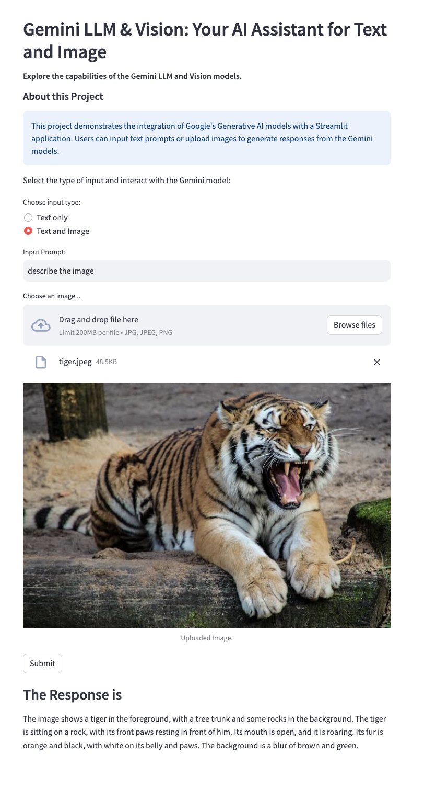

# Gemini Streamlit App

Explore the capabilities of the Gemini LLM and Vision models through this interactive Streamlit application.

#App 
https://gemini-llm-vision.streamlit.app/




## Features

- **Gemini Text Generation**: Generate insightful responses from the Gemini language model.
- **Gemini Vision Analysis**: Upload images and receive detailed analysis using the Gemini vision model.
- **Interactive UI**: Easy-to-use interface with options for both text and image inputs.
- **Custom Themes**: Beautifully themed application for an enhanced user experience.

## Installation

1. **Clone the Repository**:
    ```bash
    git clone https://github.com/kwankhede/gemini-streamlit-app.git
    cd gemini-streamlit-app
    ```

2. **Create and Activate a Virtual Environment**:
    ```bash
    python3 -m venv venv
    source venv/bin/activate  # On Windows use `venv\Scripts\activate`
    ```

3. **Install Dependencies**:
    ```bash
    pip install -r requirements.txt
    ```

4. **Set Up Environment Variables**:
    - Create a `.env` file in the root directory and add your Google API key:
      ```env
      GOOGLE_API_KEY=your_google_api_key_here
      ```

5. **Run the Application**:
    ```bash
    streamlit run app.py
    ```

## Usage

- **Text Input**: Enter a prompt and click "Ask the Question" to get a response from the Gemini language model.
- **Image Upload**: Upload an image and click "Tell me about the image" to receive a detailed analysis from the Gemini vision model.

## Configuration

The app theme is configured in `.streamlit/config.toml`:

```toml
[theme]
primaryColor = "#1E90FF"
backgroundColor = "#FFFFFF"
secondaryBackgroundColor = "#F0F2F6"
textColor = "#000000"
font = "sans serif"
